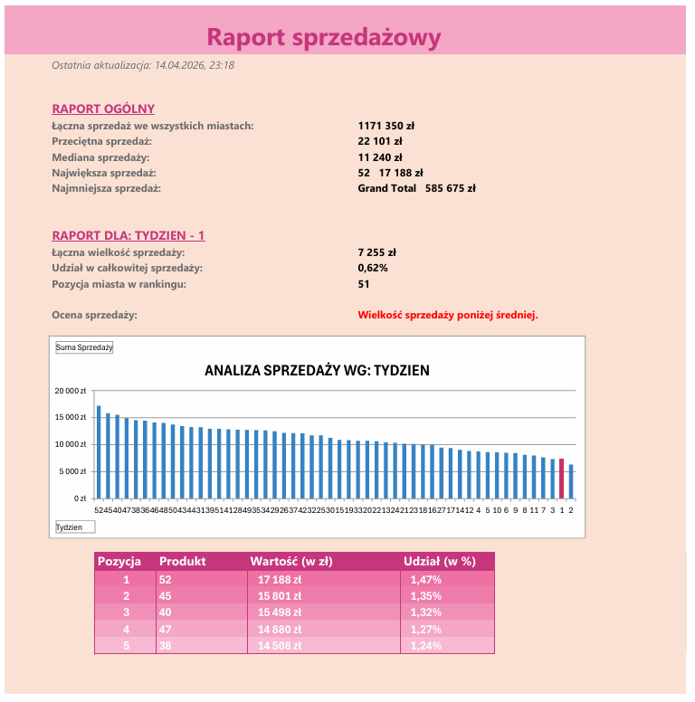

# Sales Report Creator 

An advanced automation tool designed to streamline the process of sales data analysis. It handles everything from raw data ingestion to generating tailored PDF reports for specific business categories. The project utilizes a structured Excel architecture, including automated data cleaning, dynamic pivot caches, and professional reporting layouts.

The UI was designed to be user-friendly and approachable for non-technical staff.
<table border="0">
  <tr>
    <td width="60%">
      <p align="center"><b>Live Application Demo</b></p>
      
    </td>
    <td width="40%">
      <p align="center"><b>Sample PDF Output</b></p>
      
    </td>
  </tr>
</table>

## Technical Highlights
* **Automated Data ETL:** Imports and cleans multiple `.txt` files from a user-specified directory using iterative loops and the `Dir` function.
* **Dynamic Reporting Engine:** Programmatically creates and updates PivotTables and Charts based on user selection to provide real-time insights.
* **Bulk PDF Export:** Features a logic-driven export system with custom `PageSetup` configurations, including scaling and orientation for professional delivery.
* **Statistical Analysis:** Calculates key performance indicators (KPIs) such as Average, Median, and Market Share by accessing pivot data.
* **Visual Data Highlighting:** Implements conditional chart formatting to highlight selected data points among competitors for better readability.
* 
##  Project Structure
* **`/src`** - Full source code.
* **`/assets`** - Interface screenshots.
* **`sales_raport_creator.xlsm`** - The main application file.

##  Advanced Logic Applied

### 1. String Manipulation & Data Cleaning
I implemented logic to split combined data columns into clean, usable attributes (e.g., separating "Region-City") using `InStr`, `Left`, and `Trim` to ensure data integrity.

```vba
' Example of splitting "Region-City" column
pos = InStr(1, pelnyTekst, "-") 
If pos > 0 Then
    ws.Cells(i, "F").Value = Trim(Left(pelnyTekst, pos - 1))
    ws.Cells(i, "G").Value = Trim(Mid(pelnyTekst, pos + 1))
End If
```
### 2. Programmatic PivotTable Management
The core analysis engine relies on the dynamic creation of PivotCaches and Tables, allowing the application to handle varying data sizes without manual adjustment.

```vba
' Creating PivotCache from a ListObject table
Set pc = ActiveWorkbook.PivotCaches.Create( _
    SourceType:=xlDatabase, _
    SourceData:=wsDane.ListObjects("TabelaDanych"))
```
### 3. Performance Optimization
To ensure a smooth user experience, the tool utilizes system-level optimizations:

Application.ScreenUpdating = False: Eliminates screen flickering during heavy data processing.

Application.EnableEvents = False: Prevents unnecessary trigger executions during data import.

### How to Run
1. Download the sales_raport_creator.xlsm file.

2. Open in Microsoft Excel for Windows.

3. Enable Macros when prompted to allow the VBA engine to run.

4. Follow the instructions on the Intro sheet to start importing data and generating reports.
